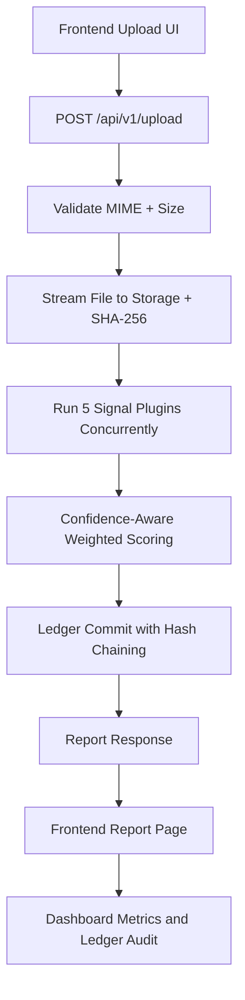

# AuthentiTrace

Multi-signal media authenticity verification with explainable scoring and a tamper-evident ledger.

This README is intentionally comprehensive and documents the whole AuthentiTrace system (backend + frontend), even though the file lives in the frontend folder.

## Table of Contents

1. [What AuthentiTrace Does](#what-authentitrace-does)
2. [System Architecture](#system-architecture)
3. [Repository Layout](#repository-layout)
4. [Trust Scoring Model](#trust-scoring-model)
5. [Risk and Enforcement Policy](#risk-and-enforcement-policy)
6. [API Reference](#api-reference)
7. [Quick Start](#quick-start)
8. [Manual Setup](#manual-setup)
9. [Frontend Configuration](#frontend-configuration)
10. [Testing](#testing)
11. [Security Notes](#security-notes)
12. [Current Constraints and Production Roadmap](#current-constraints-and-production-roadmap)
13. [Troubleshooting](#troubleshooting)

## What AuthentiTrace Does

AuthentiTrace is a trust infrastructure for digital media. A file upload goes through five independent signal analyzers, receives a weighted trust score, and is written to a cryptographically chained ledger so historical tampering can be detected.

Core outcomes per verification:

- A numeric trust score (`0.00` to `100.00`)
- A risk category (`LOW_RISK`, `MEDIUM_RISK`, `HIGH_RISK`)
- An enforcement action (`APPROVE`, `FLAG`, `RESTRICT`)
- Full signal telemetry for explainability
- A ledger receipt (`previous_hash`, `current_hash`) for auditability

## System Architecture



Backend stack:

- FastAPI
- SQLAlchemy async ORM
- SQLite (`aiosqlite`)
- Pydantic v2

Frontend stack:

- Next.js 16 (App Router)
- React 19
- TypeScript

## Repository Layout

```text
authenti_trace/
	backend/
		app/
			main.py
			api/v1/endpoints/
				upload.py
				reports.py
				dashboard.py
			services/
				media_service.py
				verification_service.py
				scoring_engine.py
				ledger_service.py
			signals/
				base.py
				content.py
				reality.py
				behavioral.py
				network.py
				integrity.py
			models/ledger.py
			schemas/verification.py
			database/database.py
			utils/security.py
		tests/test_ledger.py
		requirements.txt
	frontend/
		src/app/
			layout.tsx
			page.tsx
			upload/page.tsx
			report/[id]/page.tsx
			dashboard/page.tsx
			globals.css
		src/lib/api.ts
		package.json
		next.config.ts
```

## Trust Scoring Model

Signal plugins currently active:

1. `ContentSignal`
2. `RealitySignal`
3. `BehavioralSignal`
4. `NetworkSignal`
5. `IntegritySignal`

Each plugin returns:

- `score` in range `0..100`
- `confidence` in range `0..1`
- `reasoning`
- `metadata`

Static signal weights:

- `ContentSignal`: `1.5`
- `RealitySignal`: `1.0`
- `BehavioralSignal`: `1.2`
- `NetworkSignal`: `0.8`
- `IntegritySignal`: `1.3`

Scoring formula:

```text
effective_weight_i = base_weight_i * confidence_i
trust_score = sum(score_i * effective_weight_i) / sum(effective_weight_i)
```

Critical failure gate:

- If any signal has `score < 10` and `confidence > 0.9`, final score is capped at `20.0`.

Ledger hashing model:

```text
current_hash = SHA256(previous_hash + "|" + canonical_json(payload))
```

Payload includes:

- media id
- file hash
- score (fixed to 2 decimals)
- risk
- action
- telemetry

## Risk and Enforcement Policy

- `score < 40`: `HIGH_RISK` + `RESTRICT`
- `40 <= score < 75`: `MEDIUM_RISK` + `FLAG`
- `score >= 75`: `LOW_RISK` + `APPROVE`

## API Reference

Base URL (default local):

```text
http://localhost:8000
```

### 1) Upload and Verify

- Method: `POST`
- Path: `/api/v1/upload/`
- Content type: `multipart/form-data`
- Field: `file`

Validation rules:

- Allowed MIME types: `image/jpeg`, `image/png`, `image/webp`, `video/mp4`, `audio/mpeg`
- Max file size: `50 MB`

Returns full `ReportResponse` object, including telemetry and ledger hashes.

### 2) Fetch Report

- Method: `GET`
- Path: `/api/v1/reports/{ledger_id}`

Returns a single ledger-backed verification report.

### 3) Dashboard Metrics

- Method: `GET`
- Path: `/api/v1/dashboard/metrics`

Returns:

- `total_verifications`
- `risk_distribution` (`LOW_RISK`, `MEDIUM_RISK`, `HIGH_RISK`)

### 4) Ledger Audit

- Method: `GET`
- Path: `/api/v1/dashboard/audit`

Returns:

- `ledger_intact`
- `chain_length`
- `errors` (hash mismatch details)

## Quick Start

### Option A (Windows one-command startup)

From the workspace root (`DTI Code Base`):

```powershell
.\s.ps1
```

This delegates to `authenti_trace/s.ps1`, which:

- Starts backend on `http://127.0.0.1:8000`
- Starts frontend on `http://localhost:3000`
- Opens the browser automatically

### Option B (manual, recommended for development)

Use two terminals.

## Manual Setup

### 1) Backend

```powershell
cd authenti_trace/backend
python -m venv .venv
.\.venv\Scripts\Activate.ps1
pip install -r requirements.txt
python -m uvicorn app.main:app --host 127.0.0.1 --port 8000 --reload
```

### 2) Frontend

```powershell
cd authenti_trace/frontend
npm install
npm run dev
```

Open:

- Frontend: `http://localhost:3000`
- API docs (Swagger): `http://localhost:8000/docs`

## Frontend Configuration

The frontend API base URL is controlled by:

```text
NEXT_PUBLIC_API_URL
```

If omitted, frontend defaults to:

```text
http://localhost:8000
```

Set in `authenti_trace/frontend/.env.local`:

```env
NEXT_PUBLIC_API_URL=http://localhost:8000
```

## Testing

Current automated tests focus on ledger correctness and tamper detection.

Run backend tests:

```powershell
cd authenti_trace/backend
pytest -q
```

What is covered now:

- Genesis hash behavior
- Correct hash chain linking across commits
- Tamper detection when row data is modified post-write

## Security Notes

Implemented today:

- Upload MIME allowlist
- Upload size cap (`50 MB`)
- Streaming hash generation on ingest
- Integrity signal recomputes SHA-256 against stored file
- Tamper-evident hash chain with audit endpoint
- CORS restricted to local frontend origins

Not implemented yet:

- Authentication/authorization on API routes
- Binary signature verification (content-type spoof resistance)
- Request rate limiting
- Production-grade secret management

## Current Constraints and Production Roadmap

Current constraints:

- SQLite is good for local/dev but not ideal for high-concurrency writes
- Signal logic is deterministic/mock-oriented today (designed for real model/service swap-in)
- Verification runs inline in request lifecycle (no async job queue)

High-priority roadmap:

1. Replace SQLite with PostgreSQL and stronger transaction/locking strategy.
2. Introduce authN/authZ and rate limiting.
3. Replace simulated signal internals with production services/models.
4. Add queue-based verification workers for large media and throughput scaling.
5. Expand tests to endpoint, scoring-boundary, and end-to-end coverage.

## Troubleshooting

### Frontend cannot reach backend

- Confirm backend is running on `127.0.0.1:8000` or `localhost:8000`.
- Verify `NEXT_PUBLIC_API_URL` if you changed ports/hosts.
- Confirm CORS origin matches frontend host (`localhost:3000` or `127.0.0.1:3000`).

### Upload rejected

- Check file type matches allowed MIME set.
- Check file size is under `50 MB`.

### Ledger audit reports tampering

- Call `GET /api/v1/dashboard/audit` and inspect `errors`.
- Any mismatch means row content and stored hash chain no longer align.

---

AuthentiTrace is built for explainability first: every trust decision is traceable, inspectable, and cryptographically auditable.
